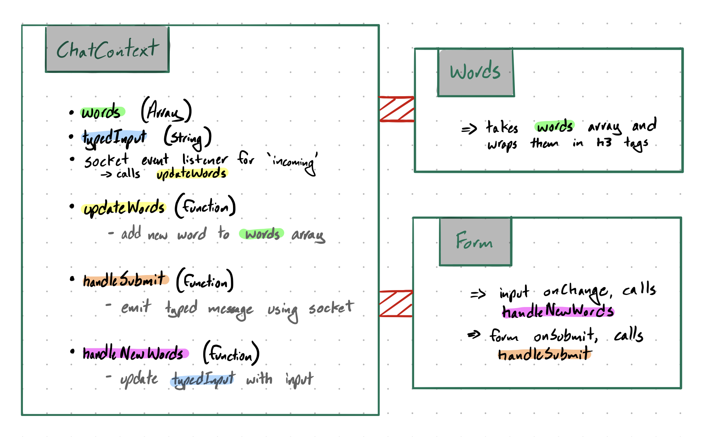

#  LAB

## Chat Application

### Author: Jagdeep Singh

### Links and Resources

- [submission PR](https://github.com/401-advanced-javascript-js/lab-32-react-chat-client/pull/1)
- [travis](https://travis-ci.com/401-advanced-javascript-js/lab-32-react-chat-client)
- [front-end, Code Sandbox](https://codesandbox.io/s/github/401-advanced-javascript-js/lab-32-react-chat-client/tree/submission)

#### Documentation

- [styleguide](styleguide/index.html)

### Setup

#### Running the app

- `npm run start`

#### Tests

- How do you run tests? `npm test`

#### UML

